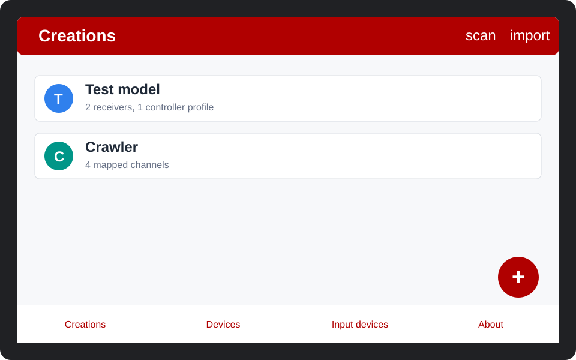
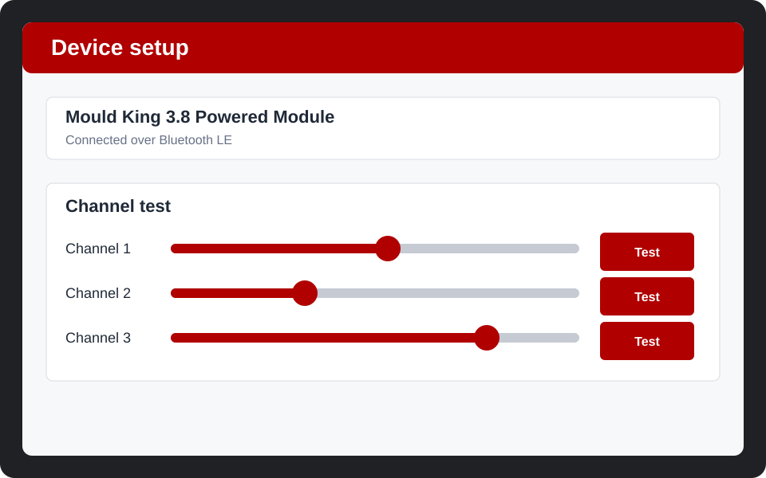

# BrickController Hilfe

BrickController steuert kompatible Bluetooth-Empfaenger mit einem Gamepad, einer Powered-Up-Fernbedienung, unterstuetzten Geraetesensoren oder der HTTP-Steuerschnittstelle.

## Modell starten

1. Oeffne `Creations`.
2. Druecke `+`, um ein Modell anzulegen.
3. Fuege die Bluetooth-Empfaenger des Modells hinzu.
4. Fuege ein Controller-Profil hinzu oder importiere es.
5. Ordne Controller-Tasten und Achsen den Empfaengerkanaelen zu.
6. Oeffne das Modell und starte die Wiedergabe.

## Empfaenger hinzufuegen

1. Oeffne `Devices`.
2. Suche nach Bluetooth-Geraeten in der Naehe.
3. Waehle einen unterstuetzten Empfaenger aus.
4. Teste jeden Kanal, bevor du ihn einem Modell zuordnest.

## Teilen und Importieren

Mit den Aktionen in der Werkzeugleiste kannst du Modelle oder Controller-Profile als Datei exportieren, als Text kopieren oder aus einer Datei beziehungsweise einem QR-Code importieren.

## Mac-Version

Die Mac-Catalyst-Version wird von Prof. Dr. Raphael Volz (Pforzheim University) betreut. Das Projekt-Repository und der aktuelle Issue Tracker befinden sich unter <https://github.com/volzinnovation/brickcontroller2/>.
