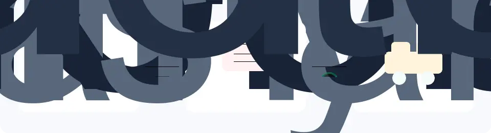

# BrickController

Cross platform application for controlling your brick creations using a your computer, your programs (via http), or a bluetooth gamepad. 

## Supported platforms
- macOS 15+ (Mac Catalyst) - with HTTP web service host
- iOS 12.2+
- Ubuntu 24.04+ / Linux GTK4 (experimental UI; Bluetooth LE and gamepad input are not implemented in the UI head yet)
- Ubuntu 24.04+ / Linux headless API host (BlueZ Bluetooth LE central over HTTP)
- Windows 10 version 1809 or higher
- Windows 11
- Android 5.0+

## Supported receivers

- SBrick - both normal and plus (output only)
- SBrick Light
- BuWizz 1
- BuWizz 2
- BuWizz 3
- LEGO® PowerFunctions infrared receiver on Android devices having IR emitter
- LEGO® Powered-Up hub
- LEGO® Boost Hub
- LEGO® Technic Hub
- LEGO® WeDo 2.0 Smart Hub
- LEGO® Technic Move Hub (PLAYVM mode)
- LEGO® Duplo Train Hub
- Circuit Cubes
- Mould King DIY Module
- Mould King 3.8 Powered Module
- Mould King 4.0 Powered Module
- Mould King 5.0 Powered Module
- Mould King 6.0 Powered Module
- CaDA Race Car
- PFx Brick (lights & Power Functions ports only)
- JieStar 4 Channel Smart Creative Module
- JieStar 8 Channel Smart Creative Module

## Supported controllers
- Generic Bluetooth / USB gamepads
- LEGO® Power Functions infrared remotes (part numbers 8885 and 8879) — requires an Android device with an IR emitter
- LEGO® Powered Up Remote (part number 88010)
- Built-in motion sensor — when supported by the device

## Project details

BrickController is a MAUI application and can be compiled using Visual Studio 2026 (Professional, Enterprise and Community Editions)
or Visual Studio for Mac. Desktop installer scripts are documented in [docs/desktop-installers.md](docs/desktop-installers.md), and the Linux headless Bluetooth API is documented in [docs/linux-headless-api.md](docs/linux-headless-api.md).

For a researched overview of supported controllers, receiver hubs, motors, lights, product availability, and servo-control options, see [Controllers and powered equipment](docs/controllers-and-equipment.md).

For the proposed open-hardware successor ecosystem—capability-based Mini,
Raspberry Pi Zero-class Midi, and accelerated AI/vision Maxi compute, Wi-Fi
and BLE, open motors/lights/sensors, brick-compatible source CAD, gears
and mechanical reference parts, MQTT coordination, and a synchronized
CAD/simulation digital twin for robots, vehicles, stationary machines, and general
automation—see **HOMBRE — Holistic Open Modular Brick Robotics Ecosystem**.
Its normative technical foundation is the
[Open Modular Brick Robotics (OMBR) 0.1 draft specification](spec/ombr/0.1/OMBR-SPEC.md).
The draft's [Creation-centered architecture](spec/ombr/0.1/OMBR-SPEC.md#51-creation-centered-lifecycle-and-integration-boundary)
connects design, Git source, simulation, digital twins, controller programs,
physical components, third-party tools, and an optional open sharing portal.
For a decision-maker overview, use the two-page
[HOMBRE executive summary](spec/ombr/0.1/HOMBRE-EXECUTIVE-SUMMARY.md)
([A4 PDF](output/pdf/HOMBRE-Executive-Summary.pdf)).
The separate [HOMBRE education curriculum draft](docs/education/HOMBRE-EDUCATION-CURRICULUM-DRAFT.md)
proposes a project-led pathway for learning modern mechanical, electronic,
software, and systems-engineering practice with the same Creation artifacts.
The concrete
[brick arm and assembly-farm engineering challenge](docs/use-cases/HOMBRE-BRICK-ARM-AND-ASSEMBLY-FARM-CHALLENGE.md)
stress-tests the specification with tiered controllers, reproducible AI and
vision and multi-Creation MQTT jobs, and proposes a farm intended to assemble
and verify a five-axis brick arm from declared prepared parts.

The companion
[HOMBRE implementation catalog](spec/ombr/0.1/IMPLEMENTATION-CATALOG.md) maps
the whole controller/peripheral/mechanical/software stack to open designs,
open-source software, and documented COTS candidates, with explicit openness
grades, alternates, gaps, and a quantity-tier cost model. The
[legal, IP, and market-access register](spec/ombr/0.1/LEGAL-IP-REGISTER.md)
tracks patent/FTO, design, trademark, CAD/catalog, protocol, licensing, product
classification, and regulatory gates without claiming legal clearance.

BrickController2 is an interim compatibility and remote-control client within
HOMBRE. The OMBR Specification covers the complete technical system:
hub and power hardware, cables, actuators, lights, sensors, brick-compatible
mechanics, full per-component electronic interface contracts, firmware,
programming runtimes, developer tools, CAD, digital twin, simulation, test
fixtures, Git-versioned Creation packages and portal exchange, repair, and
governance. Its primary planned
Workbench is an open Visual Studio Code extension over a headless core; a
cross-platform .NET application remains an interchangeable client option.

LEGO® is a trademark of the LEGO Group of companies, which does not sponsor,
authorize, or endorse HOMBRE, the OMBR Specification, or BrickController2.



## HTTP control 

The Mac app can expose a HTTP control API for external tools. For local testing, start the app with:

- `BRICKCONTROLLER_HTTP_ENABLED=1`
- `BRICKCONTROLLER_HTTP_PORT=5081`
- `BRICKCONTROLLER_HTTP_TOKEN=test-token`
- `BRICKCONTROLLER_HTTP_LISTEN_MODE=Loopback`

The example client in `example/http_mk38_motor_test_client.py` creates a virtual controller named `HTTP MK3.8 Test` with five axis capabilities:

- `mk38Channel0` / `MK38_Channel_0`
- `mk38Channel1` / `MK38_Channel_1`
- `mk38Channel2` / `MK38_Channel_2`
- `mk38Channel3` / `MK38_Channel_3`
- `mk38Channel4` / `MK38_Channel_4`

To run the end-to-end Mac MK 3.8 HTTP smoke test without running the packager:

```bash
test/test-http-mk38-client.sh
```

The script builds the Debug Mac Catalyst app, starts it with HTTP enabled and token `test-token`, enables the diagnostic profile host with `BC2_HTTP_MK38_E2E_TEST=1`, waits for `BC2_HTTP_MK38_E2E_READY` in `/tmp/brickcontroller2-http-test-app.log`, then runs the Python client. The app-side diagnostic creates or refreshes the normal BrickController creation/profile `HTTP MK3.8 End-to-End Test`, maps `HTTP MK3.8 Test` capabilities `MK38_Channel_0..4` to the Mould King MK 3.8 channels `0..4`, connects the MK 3.8 device through the normal app path, and forwards HTTP controller events through `PlayLogic`.

Each channel is set to `50%` for one second, then reset to zero before the next channel. Override defaults as needed:

```bash
BRICKCONTROLLER_TOKEN=my-token BRICKCONTROLLER_HTTP_PORT=5082 test/test-http-mk38-client.sh --power 0.5 --seconds 1
```

For a lower-level MK 3.8 Bluetooth advertising smoke test that does not use HTTP or a controller profile, run:

```bash
test/test-mk38-motor.sh
```

## 3rd party libraries used

- [Autofac IOC container](https://github.com/autofac/Autofac)
- [SQLite-Net-Extensions Async](https://bitbucket.org/twincoders/sqlite-net-extensions)
- [ZXing.Net.Maui](https://github.com/Redth/ZXing.Net.Maui)

## Additional resources used
- [Material Icons](https://github.com/google/material-design-icons/blob/master/font/MaterialIconsOutlined-Regular.otf) - [Apache-2.0 license](https://github.com/google/material-design-icons?tab=Apache-2.0-1-ov-file)

## Original Author

István Murvai

Maintainer of Mac and 2026 app store version: Prof. Dr. Raphael Volz (Pforzheim University)

## Repo maintainer and newer features

Prof. Dr. Raphael Volz (Pforzheim University)
